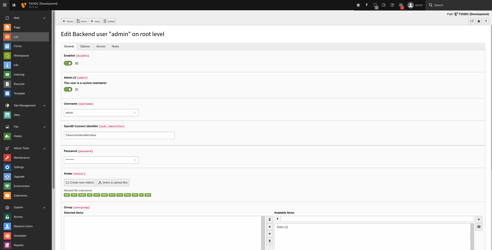
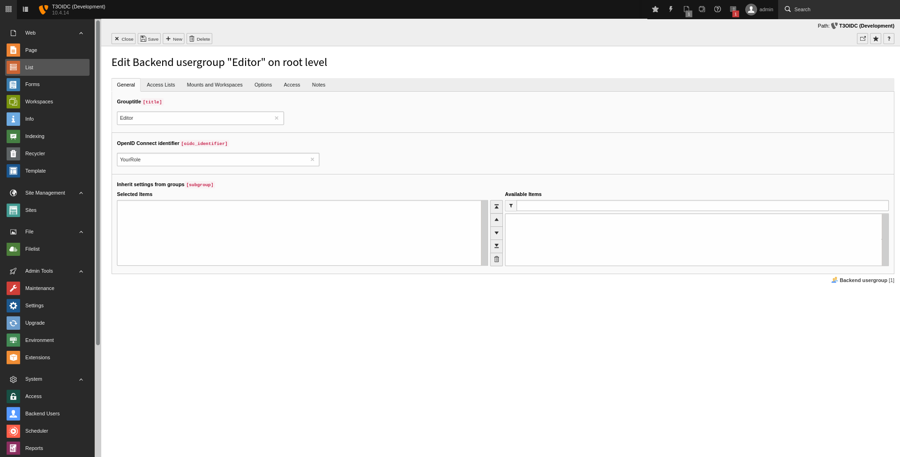

.. include:: ../../Includes.txt

.. _admin-accountConfiguration:

=====================
Account Configuration
=====================

Some configurations must be done locally to allow OIDC users to log in.

.. important::

   Having a successful authentication on the OIDC server is not enough to log in
   TYPO3. Your users must have an OIDC role matching a local configuration.

Depending on your :ref:`admin-extensionConfiguration-properties-backendUserMustExistLocally`
configuration, you may need to manually map your users by setting the value of
their :ref:`admin-extensionConfiguration-properties-tokenUserIdentifier`

Admin users
===========

In case you want to manage TYPO3 administrators via your OIDC server,
you will have to create a role and specified it in the extension
configuration (:ref:`admin-extensionConfiguration-properties-roleAdmin`).

.. tip::

   Do no create a group matching your admin role, it is useless.

Regular users
=============

Regular users must have a role matching to a local group which should contain
the main permission settings. Users can be member of one or more groups.

.. important::

   Regular backend users must have a group letting them access to a workspace
   or edit live stuff. If not, they won't be able to log inside TYPO3 and will
   get an error.

   .. figure:: ../../Images/BackendAccountNotYetConfigured.png
      :alt: Backend Account Not Yet Configured
      :class: with-shadow m-auto
