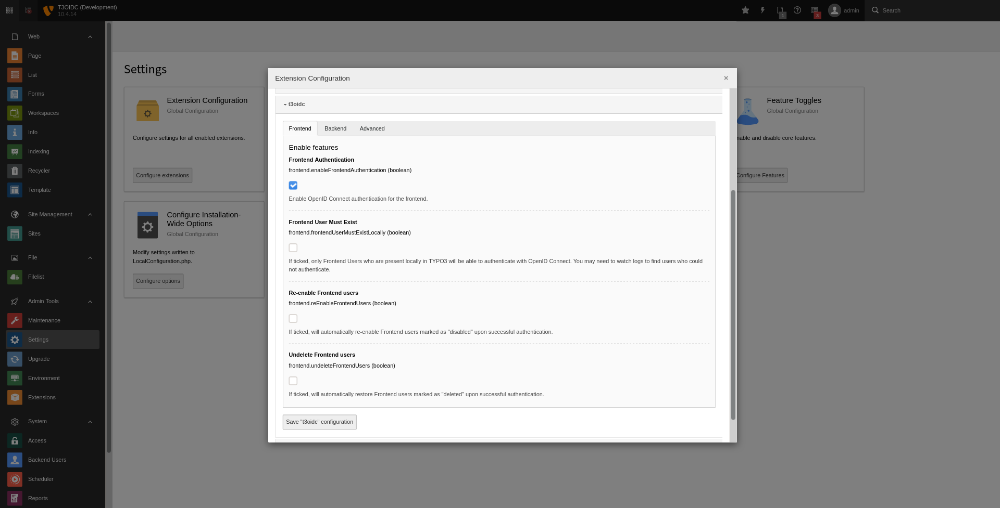

.. include:: ../../Includes.txt

.. _admin-extensionConfiguration:

=======================
Extension Configuration
=======================

All configuration is made in the "Extension Configuration" section of the "Settings" module beneath the "Admin Tools".

.. _admin-extensionConfiguration-properties:

Properties
==========

.. container:: ts-properties

   ==================================== ==================================== ==================
   Property                             Tab                                  Type
   ==================================== ==================================== ==================
   enableFrontendAuthentication_        Frontend                             boolean
   frontendUserMustExistLocally_        Frontend                             boolean
   reEnableFrontendUsers_               Frontend                             boolean
   undeleteFrontendUsers_               Frontend                             boolean
   enableBackendAuthentication_         Backend                              boolean
   backendUserMustExistLocally_         Backend                              boolean
   reEnableBackendUsers_                Backend                              boolean
   undeleteBackendUsers_                Backend                              boolean
   roleAdmin_                           Backend                              string
   clientId_                            Advanced                             string
   clientSecret_                        Advanced                             string
   clientScopes_                        Advanced                             string
   endpointAuthorize_                   Advanced                             string
   endpointToken_                       Advanced                             string
   endpointUserInfo_                    Advanced                             string
   endpointLogout_                      Advanced                             string
   tokenUserIdentifier_                 Advanced                             string
   ==================================== ==================================== ==================

.. ### BEGIN~OF~TABLE ###

.. _admin-extensionConfiguration-properties-enableFrontendAuthentication:

enableFrontendAuthentication
---------------------------
.. container:: table-row

   Property
         enableFrontendAuthentication
   Data type
         boolean
   Default
         :code:`false`
   Description
         Enable OpenID Connect login for TYPO3 frontend.

.. _admin-extensionConfiguration-properties-frontendUserMustExistLocally:

frontendUserMustExistLocally
---------------------------
.. container:: table-row

   Property
         frontendUserMustExistLocally
   Data type
         boolean
   Default
         :code:`false`
   Description
         Allow log in for existing frontend users only.

.. _admin-extensionConfiguration-properties-reEnableFrontendUsers:

reEnableFrontendUsers
--------------------
.. container:: table-row

   Property
         reEnableFrontendUsers
   Data type
         boolean
   Default
         :code:`false`
   Description
         Allow log in for disabled frontend users.

.. _admin-extensionConfiguration-properties-undeleteFrontendUsers:

undeleteFrontendUsers
--------------------
.. container:: table-row

   Property
         undeleteFrontendUsers
   Data type
         boolean
   Default
         :code:`false`
   Description
         Allow log in for deleted frontend users.

.. _admin-extensionConfiguration-properties-enableFrontendAuthentication:

enableFrontendAuthentication
---------------------------
.. container:: table-row

   Property
         enableFrontendAuthentication
   Data type
         boolean
   Default
         :code:`false`
   Description
         Enable OpenID Connect login for TYPO3 frontend.

.. _admin-extensionConfiguration-properties-backendUserMustExistLocally:

backendUserMustExistLocally
---------------------------
.. container:: table-row

   Property
         backendUserMustExistLocally
   Data type
         boolean
   Default
         :code:`false`
   Description
         Allow log in for existing backend users only.

.. _admin-extensionConfiguration-properties-reEnableBackendUsers:

reEnableBackendUsers
--------------------
.. container:: table-row

   Property
         reEnableBackendUsers
   Data type
         boolean
   Default
         :code:`false`
   Description
         Allow log in for disabled backend users.

.. _admin-extensionConfiguration-properties-undeleteBackendUsers:

undeleteBackendUsers
--------------------
.. container:: table-row

   Property
         undeleteBackendUsers
   Data type
         boolean
   Default
         :code:`false`
   Description
         Allow log in for deleted backend users.

.. _admin-extensionConfiguration-properties-roleAdmin:

roleAdmin
---------
.. container:: table-row

   Property
         roleAdmin
   Data type
         string
   Default
         unset
   Description
         OpenID Connect role used to determine TYPO3 admin users.

.. _admin-extensionConfiguration-properties-clientId:

clientId
--------
.. container:: table-row

   Property
         clientId
   Data type
         string
   Default
         unset
   Description
         Client ID

.. _admin-extensionConfiguration-properties-clientSecret:

clientSecret
------------
.. container:: table-row

   Property
         clientSecret
   Data type
         string
   Default
         unset
   Description
         Client secret

.. _admin-extensionConfiguration-properties-userStoragePage:

clientScopes
------------
.. container:: table-row

   Property
         clientScopes
   Data type
         string
   Default
         :code:`openid`
   Description
         Client scopes (comma separated list).

.. _admin-extensionConfiguration-properties-endpointAuthorize:

endpointAuthorize
-----------------
.. container:: table-row

   Property
         endpointAuthorize
   Data type
         string
   Default
         unset
   Description
         Authorization endpoint.

.. _admin-extensionConfiguration-properties-endpointToken:

endpointToken
-------------
.. container:: table-row

   Property
         endpointToken
   Data type
         string
   Default
         unset
   Description
         Token endpoint.

.. _admin-extensionConfiguration-properties-endpointUserInfo:

endpointUserInfo
----------------
.. container:: table-row

   Property
         endpointUserInfo
   Data type
         string
   Default
         unset
   Description
         User info endpoint.

.. _admin-extensionConfiguration-properties-endpointLogout:

endpointLogout
--------------
.. container:: table-row

   Property
         endpointLogout
   Data type
         string
   Default
         unset
   Description
         Logout endpoint.

.. _admin-extensionConfiguration-properties-tokenUserIdentifier:

tokenUserIdentifier
-------------------
.. container:: table-row

   Property
         tokenUserIdentifier
   Data type
         string
   Default
         :code:`sub`
   Description
         The property of the ID token containing the unique user ID.
