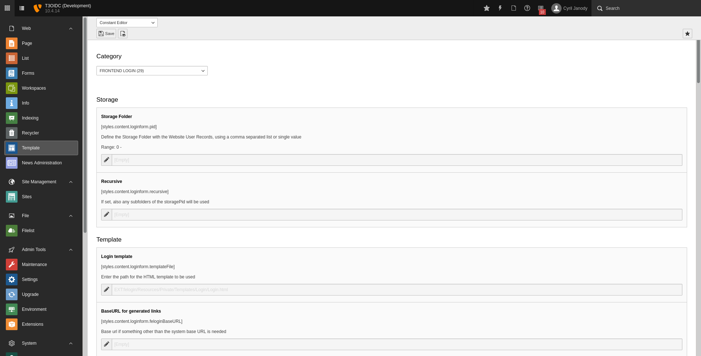

.. include:: ../../Includes.txt

.. _admin-typoScriptConfiguration:

=======================
TypoScript Configuration
=======================

All configurations are available in the category "FRONTEND LOGIN" of the "Constant Editor" section of the "Template" module beneath "Web".

.. _admin-typoScriptConfiguration-properties:

Properties
==========

.. container:: ts-properties

   ================= =============== ==================
   Property          Category        Type
   ================= =============== ==================
   templateRootPath_ Template        string
   partialRootPath_  Template        string
   layoutRootPath_   Template        string
   showLoginForm_    OpenID Connect  boolean
   ================= =============== ==================

.. ### BEGIN~OF~TABLE ###

.. _admin-typoScriptConfiguration-properties-templateRootPath:

templateRootPath
----------------
.. container:: table-row

   Property
         templateRootPath
   Data type
         string
   Default
         :code:`EXT:t3oidc/Resources/Private/Templates/FeLogin/`
   Description
         Path to template root (FE).

.. _admin-typoScriptConfiguration-properties-partialRootPath:

partialRootPath
---------------
.. container:: table-row

   Property
         partialRootPath
   Data type
         string
   Default
         unset
   Description
         Path to partial root (FE).

.. _admin-typoScriptConfiguration-properties-layoutRootPath:

layoutRootPath
--------------
.. container:: table-row

   Property
         layoutRootPath
   Data type
         string
   Default
         unset
   Description
         Path to layout root (FE).

.. _admin-typoScriptConfiguration-properties-showLoginForm:

showLoginForm
-------------
.. container:: table-row

   Property
         showLoginForm
   Data type
         boolean
   Default
         :code:`false`
   Description
         If set, the section in the template to display the default login form of TYPO3 is visible.
