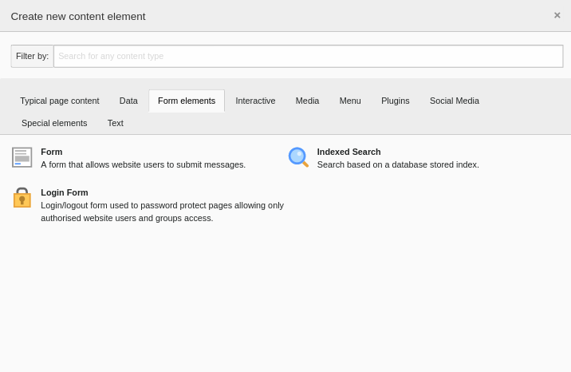
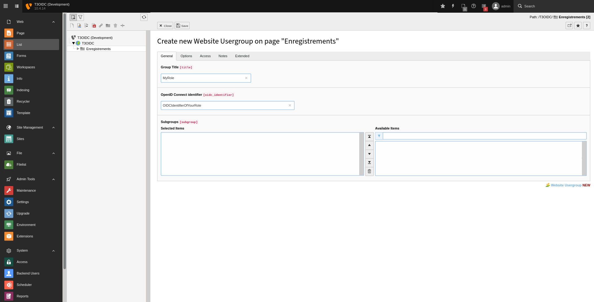

.. include:: ../Includes.txt

.. _editor:

==================
For Editors
==================

.. _editor-configuration:

Configuration
============

Depending on access rights, editors can add an felogin content element and map
OIDC roles to user groups

Plugin
______

User groups
-----------

