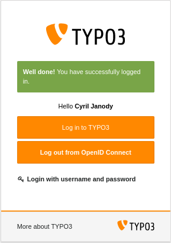

.. include:: ../Includes.txt

.. _introduction:

============
Introduction
============

What does it do?
================

This extension lets you authenticate backend users against an OpenID Connect server.

.. _screenshots:

Screenshots
===========

   Backend login interface after installation.

   Backend login interface after a successful log in.

